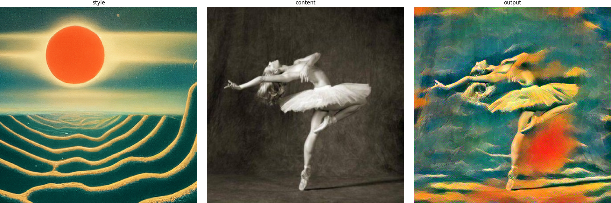

# neural_style_transfer

change config in `main.py` to needed
```
  ''' setting up config '''
  STYLE_IMG_PATH = './style_imgs/picasso.jpg'
  CONTENT_IMG_PATH = './content_imgs/dancing.jpg'
  SAVE_NAME = 'result_test.jpg'
    
  NUM_STEPS = 150
  STYLE_WEIGHT = 1000000
  CONTENT_WEIGHT = 1
  ''' setting end '''
```
demo

